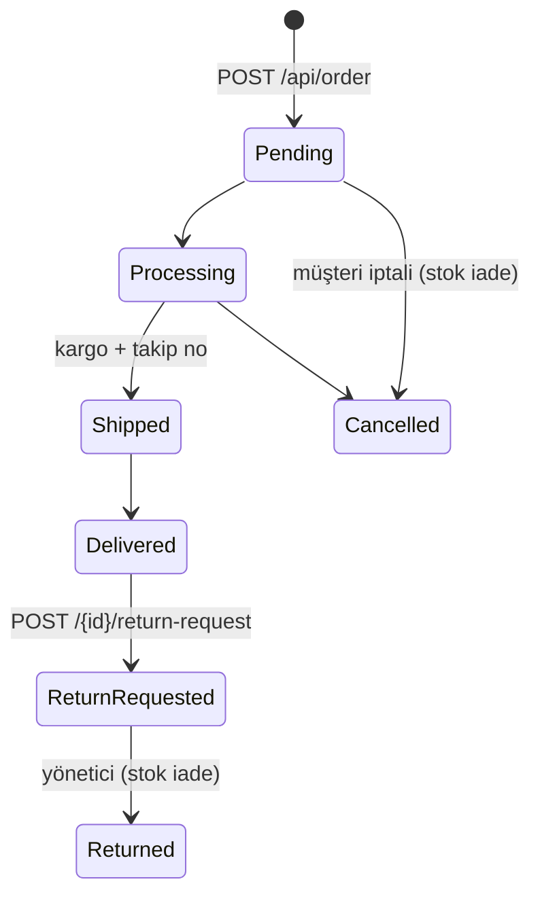

# E-Ticaret Backend — Spring Boot

[](https://adoptium.net/)
[](https://spring.io/projects/spring-boot)
[](https://www.postgresql.org/)
[](docs/API_CONTRACT.md)

**PazarKapısı** demo e-ticaret sitesinin Spring Boot backend'i. Ürün kataloğu, sepet, ödeme ve sipariş akışı, kullanıcı hesabı, bildirimler, yardım merkezi ve yönetim paneli için REST API sunar.

Bu proje [**backend-dotnet**](https://github.com/MihrimatriX/backend-dotnet) ile **ikizdir**: iki backend ayrı kod tabanlarıdır ama
[`docs/API_CONTRACT.md`](docs/API_CONTRACT.md)'deki **aynı HTTP sözleşmesini** uygular. Vitrin
([temp-shop-net](https://github.com/MihrimatriX/temp-shop-net)) yalnızca API adresini değiştirerek hangisine bağlanacağını seçer.

<p align="center">
  
  <br><em>temp-shop-net vitrini bu backend'e bağlı (<code>NEXT_PUBLIC_API_URL=http://localhost:8081</code>)</em>
</p>

---

## İçindekiler

- [İkiz backend yaklaşımı](#ikiz-backend-yaklaşımı)
- [Hızlı başlangıç](#hızlı-başlangıç)
- [Demo hesapları](#demo-hesapları)
- [API'ye genel bakış](#apiye-genel-bakış)
- [Cevap biçimi ve hatalar](#cevap-biçimi-ve-hatalar)
- [İş kuralları](#iş-kuralları)
- [Yapılandırma](#yapılandırma)
- [Test](#test)
- [Proje yapısı](#proje-yapısı)
- [İzleme](#izleme)
- [Sorun giderme](#sorun-giderme)

---

## İkiz backend yaklaşımı

| | backend-spring (bu repo) | backend-dotnet |
|---|---|---|
| Çatı | Spring Boot 3.4 · Java 17 | ASP.NET Core 9 · C# |
| Varsayılan adres | `http://localhost:8081` | `http://localhost:5000` |
| Geliştirme veritabanı | H2 (bellek içi) | SQLite (`ecommerce.db`) |
| Üretim veritabanı | PostgreSQL + Flyway | PostgreSQL + EF Core migration |
| Swagger | `/swagger-ui.html` | `/swagger` |
| **HTTP sözleşmesi** | **aynı** — [`docs/API_CONTRACT.md`](docs/API_CONTRACT.md) | **aynı** |

Aynı olan her şey: rotalar, istek/cevap alan adları, `{ success, message, data, errorCode, … }` zarfı, HTTP durum kodları,
hata kodları ve mesajları, JWT claim'leri (`sub`, `email`, `role`), sayfalama, tarih biçimi (UTC `Z`), kargo/indirim/stok
kuralları ve demo hesapları. Bunu iki taraf da aynı testle doğrular:

<p align="center"></p>

Vitrini bu backend'e bağlamak için temp-shop-net'te:

```bash
NEXT_PUBLIC_API_URL=http://localhost:8081 npm run dev
```

---

## Hızlı başlangıç

### Seçenek 1 — Docker Compose (PostgreSQL + Redis + RabbitMQ + Flyway + API)

```bash
docker compose up --build -d
```

| Servis | Adres |
|---|---|
| API | http://localhost:8081 |
| Swagger UI | http://localhost:8081/swagger-ui.html |
| Sağlık | http://localhost:8081/actuator/health · http://localhost:8081/api/health |
| RabbitMQ yönetim | http://localhost:15673 (guest / guest) |

Flyway konteyneri şemayı ve örnek kataloğu kurar, ardından API başlar. Host portları `.env` ile değiştirilebilir
(`cp .env.example .env`). Temiz başlangıç için: `docker compose down -v`.

### Seçenek 2 — Yerelde (H2, dış servis gerekmez)

Gereken: JDK 17+.

```bash
./mvnw spring-boot:run          # Windows: mvnw.cmd spring-boot:run
# veya Node yüklüyse: npm run dev
```

`dev` profili bellek içi H2 kullanır; uygulama her açılışta kategori, ürün, kampanya, yorum, alt kategori, SSS ve demo
hesaplarını yükler. H2 konsolu: http://localhost:8081/h2-console (`jdbc:h2:mem:testdb`, kullanıcı `sa`, şifre boş).

<p align="center"></p>

---

## Demo hesapları

Her profilde başlangıçta idempotent olarak oluşturulur (e-posta varsa dokunulmaz).

| E-posta | Şifre | Rol |
|---|---|---|
| admin@example.com | admin123 | Admin |
| manager@shop.demo | Manager123! | Admin |
| user1@example.com … user4@example.com | user123 | User |
| support@shop.demo | Support123! | User |
| demo.buyer@shop.local | Buyer123! | User |
| staff@shop.demo | Staff123! | User |

Admin rolü `app.auth.admin-emails` (ortam değişkeni `ADMIN_EMAILS`) listesinden gelir. Üretimde şifreleri ve listeyi değiştirin.

---

## API'ye genel bakış

Tüm uçlar `/api` altındadır. Ayrıntılar, alan adları ve hata kodları için [**API sözleşmesi**](docs/API_CONTRACT.md).

| Modül | Örnek uçlar | Yetki |
|---|---|---|
| Kimlik | `POST /api/auth/register` · `login` · `logout` | Anonim |
| Katalog | `GET /api/product?searchTerm=&categoryId=&sortBy=UnitPrice&sortOrder=desc&pageNumber=1&pageSize=12` · `/api/product/{id}` · `/featured` · `/discounted` · `/api/category` · `/api/subcategory` · `/api/campaign/active` | Anonim (yazma: Admin) |
| Yorumlar | `GET /api/review/product/{id}` · `/summary` · `POST /api/review` | Okuma anonim, yazma kullanıcı |
| Sepet | `GET /api/cart` · `POST /add` · `PUT /update` · `DELETE /remove/{productId}` · `GET /count` | Kullanıcı |
| Sipariş | `POST /api/order` (opsiyonel `Idempotency-Key`) · `GET /api/order` · `PUT /{id}/cancel` · `POST /{id}/return-request` | Kullanıcı |
| Hesap | `/api/address` · `/api/paymentmethod` · `/api/favorite` · `/api/notification` · `/api/security` · `/api/settings` | Kullanıcı |
| Yardım | `GET /api/helpsupport/faqs` · `/articles` · `POST /contact` · `/tickets` | Karışık |
| Yönetim | `GET /api/order/admin` · `PUT /api/order/{id}/status` · `GET /api/review/admin` · `GET /api/helpsupport/tickets/admin` | Admin |
| Durum | `GET /api/test/hello` · `/api/health` · `/api/metrics/custom` · `/api/metrics/prometheus` | Anonim |

<table>
<tr>
<td></td>
<td></td>
</tr>
</table>

---

## Cevap biçimi ve hatalar

Başarılı cevaplar `data` taşır; hatalar aynı zarfta `errorCode` ve `traceId` (= `X-Correlation-Id` başlığı) ile döner.

<table>
<tr>
<td></td>
<td></td>
</tr>
</table>

| HTTP | `errorCode` örnekleri |
|---|---|
| 400 | `VALIDATION_ERROR` (alan bazlı `errors` ile), `BAD_REQUEST`, `CART_MISMATCH`, `CHECKOUT_FAILED`, `CANCEL_NOT_ALLOWED` … |
| 401 | `UNAUTHORIZED`, `INVALID_CREDENTIALS` |
| 403 | `FORBIDDEN` |
| 404 | `NOT_FOUND`, `PRODUCT_NOT_FOUND`, `ORDER_NOT_FOUND` … |
| 409 | `EMAIL_TAKEN`, `CONFLICT` |
| 429 | `RATE_LIMITED` |

**JWT:** HS256, 24 saat. Claim'ler `sub` (kullanıcı id), `email`, `role` (`Admin`/`User`), `jti`, `iss`, `aud`.
`POST /api/security/logout-all-devices` çağıran token hariç kullanıcının tüm token'larını geçersiz kılar.

---

## İş kuralları

- **Fiyat:** satış fiyatı = `unitPrice × (1 − discount/100)` (2 basamağa yuvarlanır). Sepet ve sipariş bu fiyatı kullanır.
- **Kargo:** ara toplam 150 TL altındaysa 34,99 TL, üstünde ücretsiz (`app.checkout.*`).
- **Sipariş:** sepet ile ödeme özeti birebir eşleşmeli (`CART_MISMATCH`); stok tek transaction içinde ve iyimser kilitle düşülür; ödeme simülasyonu kartın son kullanma tarihini kontrol eder; aynı `Idempotency-Key` ile tekrar gönderilen istek aynı siparişi döndürür.
- **Kart verisi:** tam kart numarası ve CVV saklanmaz; yalnızca `**** **** **** 1234` biçimi tutulur.



Her durum değişikliği kullanıcıya bildirim olarak düşer. Geliştirmede `POST /api/order/{id}/demo/advance-fulfillment`
siparişi bir sonraki lojistik adımına taşır (`app.ecommerce.demo-fulfillment-enabled`).

---

## Yapılandırma

| Ayar | Ortam değişkeni | Varsayılan |
|---|---|---|
| Aktif profil | `SPRING_PROFILES_ACTIVE` | `dev` |
| JWT anahtarı / süre | `JWT_SECRET` / `JWT_EXPIRATION` (ms) | geliştirme anahtarı / `86400000` |
| JWT issuer / audience | `JWT_ISSUER` / `JWT_AUDIENCE` | `EcommerceBackend` / `EcommerceUsers` |
| Yönetici e-postaları | `ADMIN_EMAILS` | `admin@example.com,manager@shop.demo` |
| CORS origin'leri | `ALLOWED_ORIGINS` | `http://localhost:3000, :5173, :8080` |
| Hız limiti (istek/dk/IP) | `RATE_LIMIT` | `300` (`0` = kapalı) |
| Kargo eşiği / ücreti | `app.checkout.free-shipping-threshold` / `standard-shipping-fee` | `150.00` / `34.99` |
| Demo lojistik | `app.ecommerce.demo-fulfillment-enabled` | dev/docker: `true`, prod: `false` |
| PostgreSQL (prod) | `DB_HOST`, `DB_PORT`, `DB_NAME`, `DB_USERNAME`, `DB_PASSWORD` | — |
| Redis / RabbitMQ (prod) | `REDIS_HOST`, `REDIS_PORT`, `RABBITMQ_HOST` … | — |

Profiller: `dev` (H2), `docker` (compose içi PostgreSQL/Redis/RabbitMQ), `prod` (Flyway uygulamanın içinde çalışır).

---

## Test

```bash
./mvnw test                                            # birim + entegrasyon (H2)
node scripts/contract-smoke.mjs run http://localhost:8081 out-spring.json   # sözleşme testi (~200 kontrol)
node scripts/contract-smoke.mjs compare out-dotnet.json out-spring.json      # iki backend'i karşılaştır
```

Sözleşme testi kayıt → adres/kart → sepet → sipariş → iade → yorum → ayarlar → yönetim akışını gerçek HTTP ile yürütür;
beklenen durum kodunu, `data` varlığını ve tarih biçimini doğrular, her cevabın şeklini kaydeder.

---

## Proje yapısı

```
src/main/java/com/ecommerce/backend
├── application
│   ├── dto/            # İstek/cevap modelleri (sözleşme §3)
│   ├── exception/      # ApiException → ortak hata zarfı
│   └── service/        # İş kuralları
├── domain/entity/      # JPA varlıkları
└── infrastructure
    ├── config/         # Güvenlik, JSON, CORS, Swagger, ayar sınıfları
    ├── data/           # Başlangıç verisi (idempotent)
    ├── messaging/      # RabbitMQ sipariş olayları
    ├── repository/     # Spring Data JPA
    ├── security/       # JWT, hız limiti, korelasyon, güvenlik başlıkları
    └── web/            # Controller'lar, hata yönetimi
src/main/resources/db/migration   # Flyway (PostgreSQL)
docs/API_CONTRACT.md              # Ortak sözleşme (backend-dotnet ile aynı)
scripts/contract-smoke.mjs        # Sözleşme testi (backend-dotnet ile aynı)
```

---

## İzleme

- Actuator: `/actuator/health`, `/actuator/prometheus`, `/actuator/metrics`
- Sözleşme uçları: `/api/health` (bileşen bazlı), `/api/metrics/prometheus`, `/api/metrics/custom`
- Prometheus + Grafana: `docker compose -f docker/docker-compose.yml up -d` (hazır dashboard'lar `docker/monitoring/`)
- Her istekte `X-Correlation-Id` üretilir/taşınır ve loglarda `cid=` olarak görünür.

---

## Sorun giderme

| Belirti | Çözüm |
|---|---|
| Vitrinde CORS hatası | Vitrin origin'ini `ALLOWED_ORIGINS`'e ekleyin |
| `8081` portu dolu | `--server.port=…` veya `.env` içinde `HOST_API_PORT` |
| Docker'da API başlamıyor | `docker compose logs flyway spring-backend --tail 80` |
| 401 "Kimlik doğrulama gerekli." | Token süresi dolmuş veya `logout-all-devices` ile iptal edilmiş olabilir; tekrar giriş yapın |
| 429 `RATE_LIMITED` | `RATE_LIMIT` değerini artırın veya `0` yapın |

Tarayıcıdan hızlı deneme notları: [TARAYICI.md](TARAYICI.md) · Dağıtım: [DEPLOYMENT.md](DEPLOYMENT.md)

## Lisans

MIT
